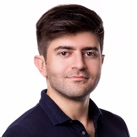

## Personal data
  
Name:   Dmitry Shyshov  
Location: Ukraine  
## Projects 
Name: [SocialMedia.Market](../projects/socialmedia_market.md)  
Position: Co-founder & CEO   
## Contacts
[LinkedIn](https://www.linkedin.com/in/dmitryshyshov/)    
## About
A passionate entrepreneur, the CEO and founder of R.Games and Nontita Limited, operating in games and Esports industries. Over the past 3 years R.Games sold more than 10M games and became one of the top private game retailers. Nontita Limited operates on a market of virtual items and digital goods, being the entity behind CSGO.CASH - popular marketplace for virtual items. As an early adopter of influencer marketing strategy, Dmitry has a vast experience in it, as well as understanding of the internal operations on the market. 
