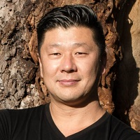

## Personal data
  
Name:   Dorjee Sun  
Location: Singapore  
## Projects 
Name: [Devery.io](../projects/devery_io.md)  
Position: Strategy & Logistics Advisor   
## Contacts  
[LinkedIn](https://www.linkedin.com/in/dorjee/)
## About
Serial social entrepreneur, COO of Santiment.net a token based big data cryptocurrency project that led ProjectTransparency.org and raised $12M in a token offering. Advisor to cryptocurrency projects, Director of the Home Group which is an investor and incubator for companies committed to improving our home in areas from conservation, climate change, agricultural waste management, consumer technology, education, tourism and philanthropy. Angel investor and mentor for startups in cryptocurrency, decentralised apps, network software, nanotechnology, quantum startups etc. Co-founder of multiple companies, won the Carbon Finance Deal of the Year Award raising a facility up to $432M USD for rainforest protection, was subject of an award winning documentary narrated by Hugh Jackman “The Burning Season”. The African Rainforest Conservancy honored Dorjee with an Earth Day Award and by naming a newly discovered blue spotted species of chameleon from the Tanzania rainforest – the “Kinyongia dorjeesuni” - after him. TIME Magazine has named Dorjee a TIME Hero of the Environment and he was named one of Esquire Magazine’s 5 Gentlemen of Philanthropy. Dorjee has won the Asialink Leaders Program Alumni Award, been named one of Australia’s Young Leaders by The Australian newspaper, he is a World Economic Forum (WEF) Young Global Leader, an Asia Society 21 Fellow and is also the Chairman of the Nexus Singapore Philanthropy Conference. His work has been front page of Wall Street Journal, TIME magazine and covered in Fortune, Forbes, ABC, PBS, BBC, Discovery, CNBC and other media outlets. Dorjee has a law degree, commerce degree and diploma of Asian Studies (Mandarin) from the University of New South Wales, studied at Peking University, North Sydney Boys High.
