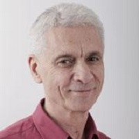

## Personal data
  
Name:   Hezy Yeshurun  
Location: Israel  
## Projects 
Name: [Gladius](../projects/gladius.md)  
Position: Business Growth & Security Advisor   
## Contacts
[LinkedIn](https://www.linkedin.com/in/yehezkel-hezy-yeshurun-080b94b1/)  
## About
Hezy Yeshurun offers invaluable technical and entrepreneurial insights as the Chairman and Co-founder of ForeScout. Hezy is a thought leader who has founded several successful technology companies, including TapGuard (acquired by Elron Software) and Top Image Systems. Hezy is a Professor of Computer Science at Tel Aviv University with a focus on Computer Vision and Computation Neuroscience.
