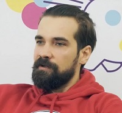

## Personal data
  
Name:   Konstantin Ivanov  
Location: Russian Federation  
## Projects 
Name: [SOFIN](../projects/sofin.md)  
Position: Adviser   
## Contacts  
-//-  
## About
[YouTube](https://www.youtube.com/watch?v=9kDIJKK956M)  
Founder of the world's largest social network for traders tradingview.com, which works in 16 countries. More than 2 000 000 active traders use the platform every month. Today, Trading View is the main technical analysis tool for traders in the 12 most popular cryptocurrency: Bitcoin, Ethereum, Bitcoin Cash, Ripple, Litecoin, Ethereum Classic, Dash, Monero, Zcash, Golem, Steem, Gnosis.
