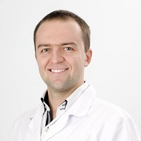

## Personal data
  
Name:   Konstantin Sablin  
Location: Russian Federation  
## Projects 
Name: [Skychain](../projects/skychain.md)  
Position: Medicine Adviser   
## Contacts  
[Facebook](https://www.facebook.com/dr.sablin)      
## About
Andrologist, urologist, endocrinologist with more than 8 year’s experience. The member of The European Association of Urologists (EAU). The member of The Russian Community of Urologists (RCU). The member of The International Society for the Study of the Aging Male. Confident that neural networks will perform diagnostics better than humans, in the nearest future. That is the reason of joining the project “Skychain”. 
Education: The Sechenov Moscow Medical Academy Diploma in “General Medicine (health care)”
