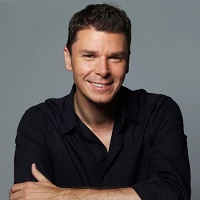

## Personal data
  
Name:   Matthew Roszak  
Location: USA  
## Projects 
Name: [Metronome](../projects/metronome.md)  
Position: Co-founder & Chairman   
## Contacts
[LinkedIn](https://www.linkedin.com/in/matthewroszak/)    
[Twitter](https://twitter.com/matthewroszak)    
[Facebook](https://www.facebook.com/matthewroszak)
## About
Matthew Roszak is co-founder and chairman of Bloq, a leading blockchain technology company. Mr. Roszak is also founding partner of Tally Capital, a private investment firm focused on cryptocurrencies and blockchain-enabled technology with a portfolio of over 40 investments, including Block.One, Blockstream, Civic, Doc.ai, Factom, Genaro, Orchid, Rivetz, Token Report and Qtum.
Mr. Roszak serves as chairman of the Chamber of Digital Commerce, the world’s largest trade association representing the blockchain industry. In addition, Mr. Roszak serves on the board of BitGive, a non-profit foundation targeting public health and the environment. Mr. Roszak is also the founder of the Chicago Blockchain Center, a public-private partnership with the State of Illinois, CME Group, DRW and Lightbank. Mr. Roszak was a producer of the industry’s first ever documentary, The Rise and Rise of Bitcoin.
Mr. Roszak is a sought after thought leader on blockchain technology, and has testified as an expert before U.S. Congress and spoken at the U.S. Federal Reserve. Mr. Roszak has presented at TEDx, been featured on CNBC and quoted in The Wall Street Journal, Bloomberg and Financial Times. In addition, Mr. Roszak has been a speaker at FinTech conferences worldwide, including Money20/20, CES and American Banker.
