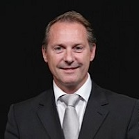

## Personal data
  
Name:   Peter Kristensen  
Location: USA
## Projects 
Name: [Modex](../projects/modex.md)  
Position: Advisor   
## Contacts
[LinkedIn](https://www.linkedin.com/in/peter-kristensen-30b136a/)      
## About
Voted top Asian Fund Administrator category in Hedgeweek’s annual awards ceremony.
Peter Kristensen is the CEO of JP Fund Services, co-founder of JP Funds Group and other ventures and start-ups. He has entered the finance industry in Denmark in 1986 and since then has been engaged in the challenges and opportunities the industry has been going through. In the mid 1990s, he began working for Saxo Bank, global pioneer of the online trading industry.
