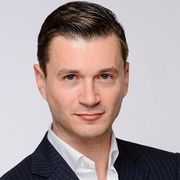

## Personal data
  
Name:   Sascha Schumann  
Location: Germany  
## Projects 
Name: [COPYTRACK](../projects/copytrack.md)  
Position: Advisor IT-Security   
## Contacts
[LinkedIn](https://www.linkedin.com/in/sascha-schumann-41792a5b/)    
## About
Sascha is CEO of Germany’s Myra Security, helping governments and global E-Commerce companies to protect themselves against permanent online threats. He is a member of the PHP Group which oversees the well-being of the OpenSource language PHP.
